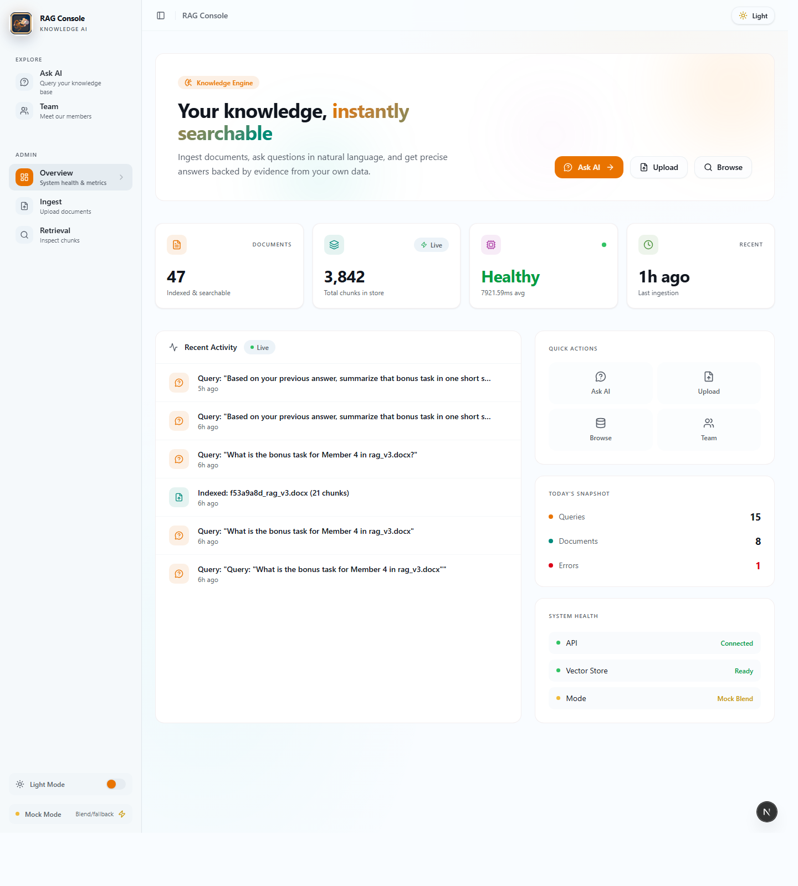
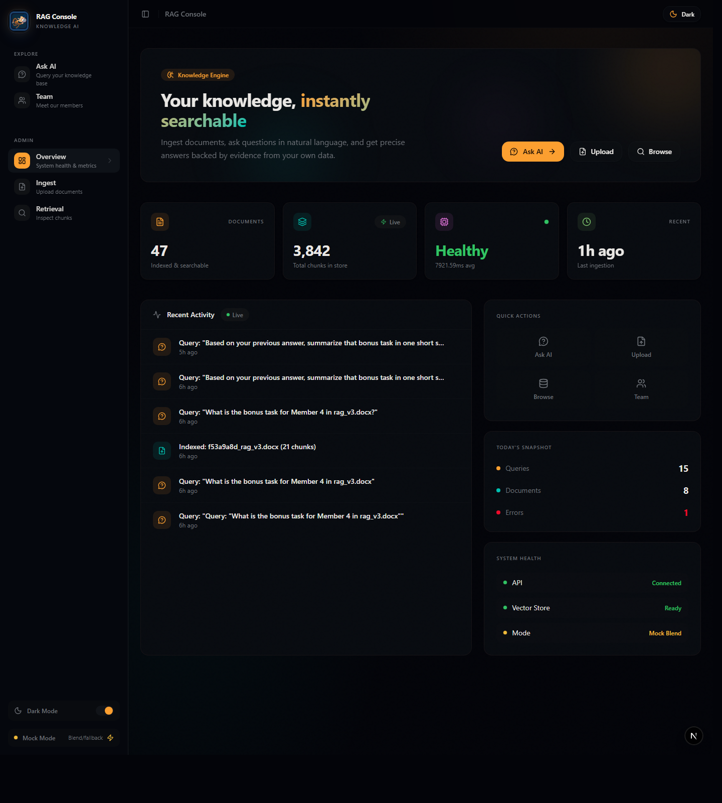
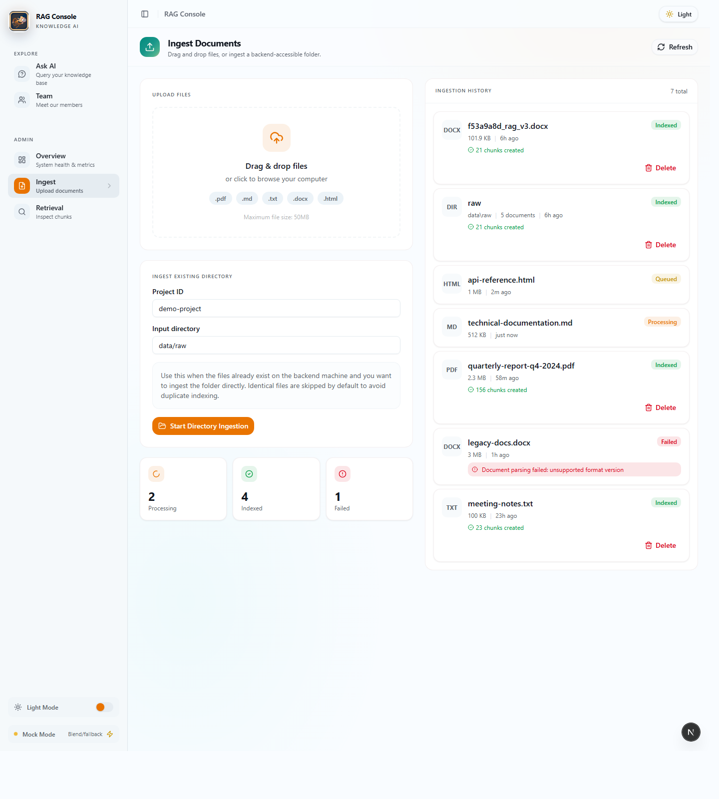
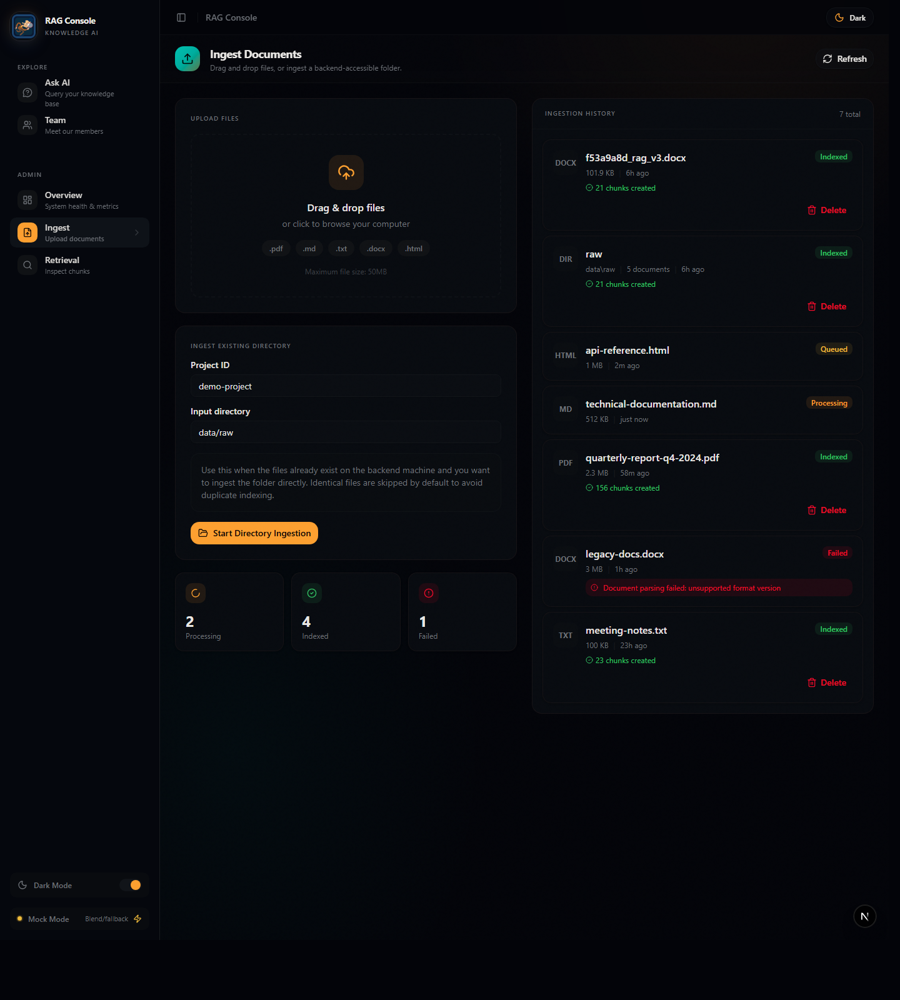
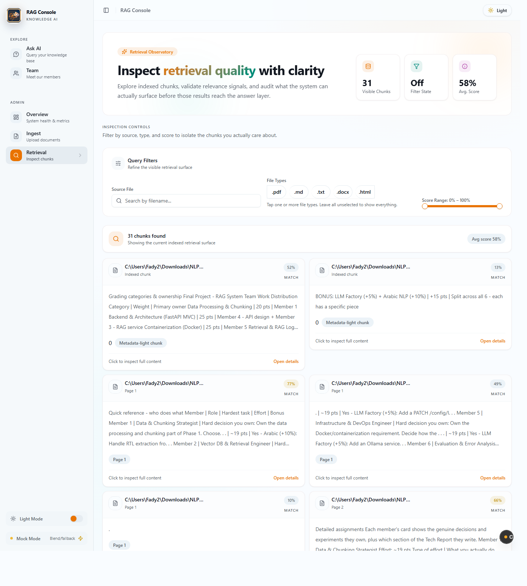
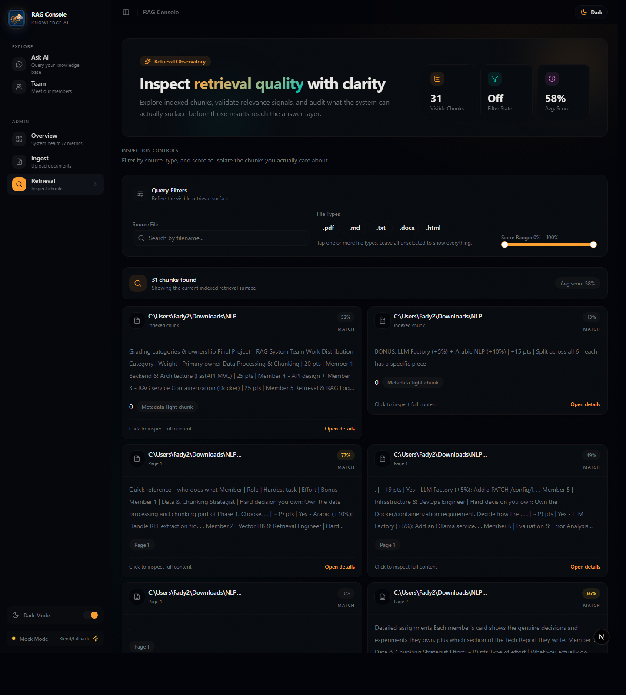
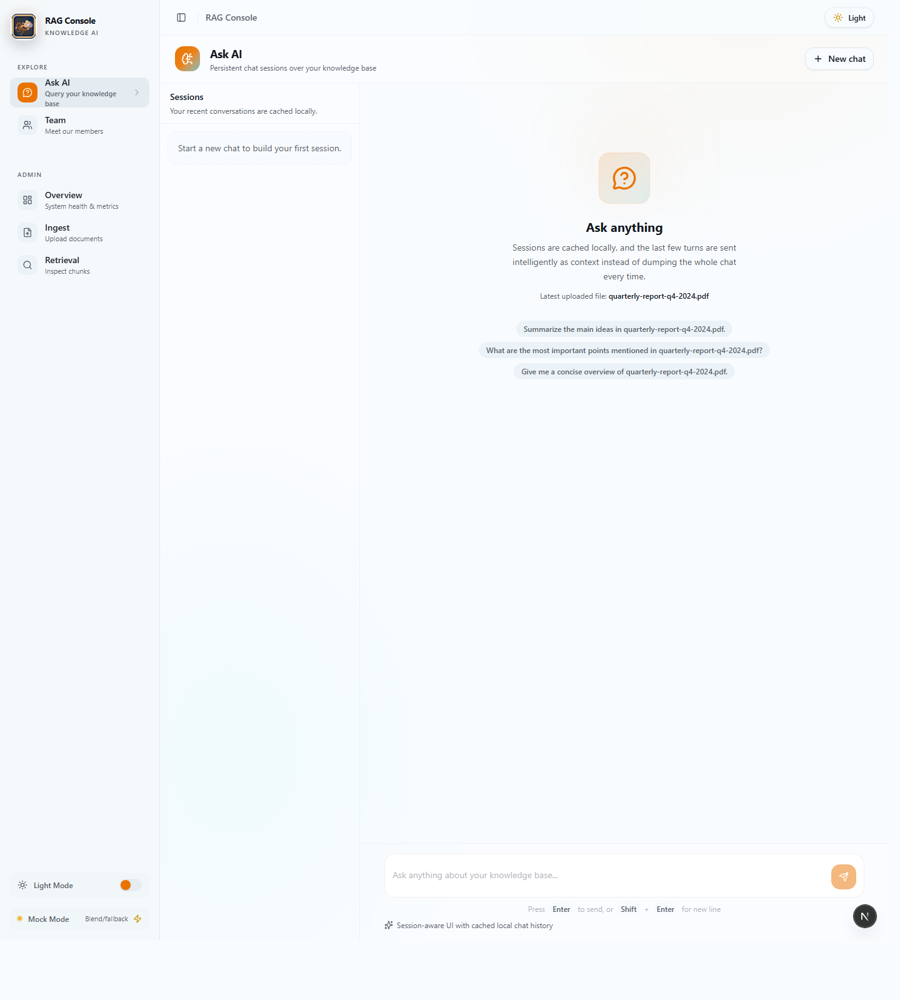
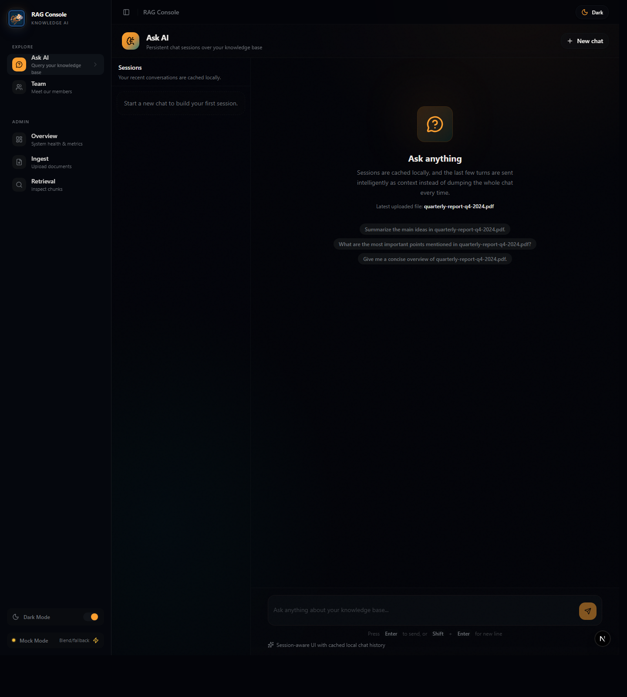
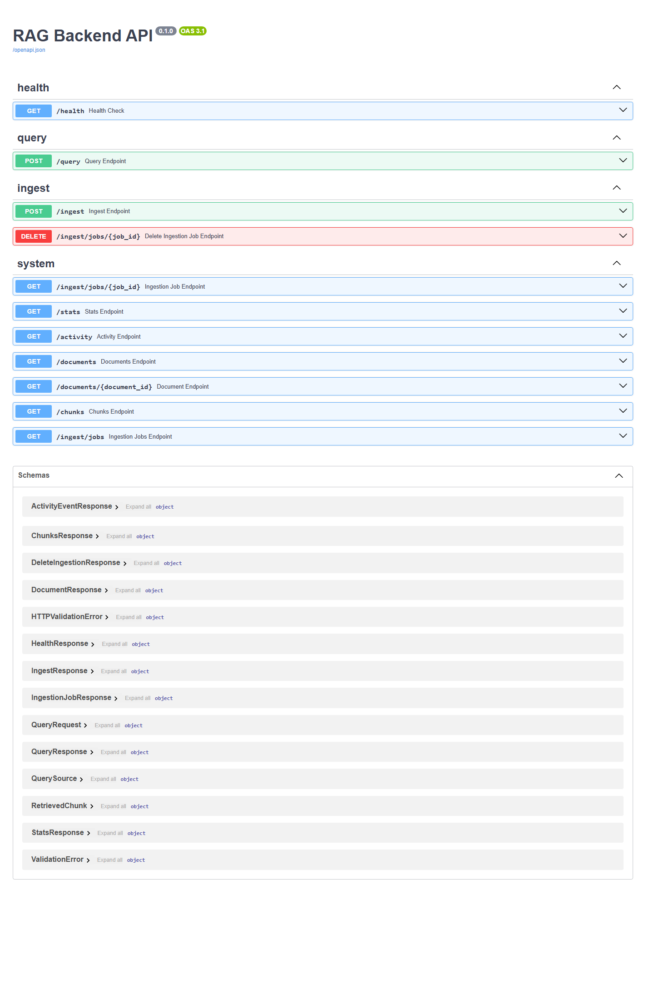
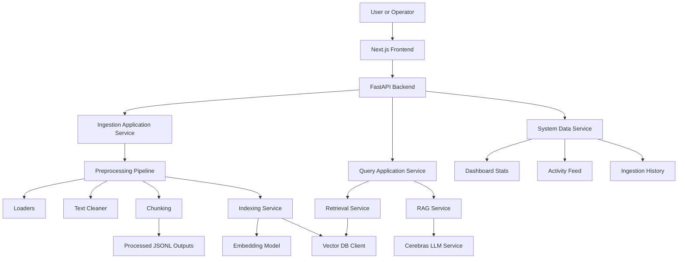

<div align="center">

# RAG Console 🚀

### Intelligent document ingestion, retrieval, inspection, and grounded AI answers in one polished full-stack workspace


**A portfolio-ready RAG platform that feels like a real product, not a toy demo.**

</div>

---

> 🌟 This repository transforms private documents into a searchable knowledge system with ingestion flows, preprocessing, retrieval, inspection tooling, and a polished AI chat experience.

> 💡 If you want the fastest understanding of the project, start with the highlights, the gallery, and the architecture section.

<p align="center">
  <i>Built for demos, coursework, portfolio presentation, and practical experimentation with real RAG workflows.</i>
</p>

## Quick Highlights ✨

| Highlight | What it gives you |
| --- | --- |
| 📄 Ingestion pipeline | Upload files or process document folders through a real backend flow |
| 🧠 Retrieval workflow | Chunk, index, inspect, and query your knowledge base with traceable behavior |
| 🖥️ Product-style UI | Overview, ingest, retrieval, ask, and docs screens with light/dark support |
| 🧪 Mock mode | Clean fallback mode for demos, UI work, and disconnected development |
| 🔍 Admin visibility | Stats, health, activity, and retrieval inspection from one console |
| 🌍 Multilingual support | Arabic-aware preprocessing and normalization-friendly pipeline design |

## Why It Feels Different ⭐

Many repositories can answer a question from documents.

Fewer repositories make the whole experience feel complete.

This one is designed to show the full picture:

- how documents enter the system,
- how they are cleaned and chunked,
- how retrieval can be inspected instead of guessed,
- how the backend exposes the workflow cleanly,
- and how the frontend turns all of that into a usable product experience.

That is what gives the project stronger presentation value and stronger engineering value at the same time.

## At A Glance ⚡

An end-to-end Retrieval-Augmented Generation platform that combines:

- document ingestion,
- multilingual preprocessing,
- chunking,
- vector indexing,
- retrieval,
- LLM answering,
- a FastAPI backend,
- and a polished Next.js frontend.

This repository is not just a proof of concept.

It covers the full workflow:

1. bring documents into the system,
2. normalize and chunk them,
3. index them into a retrieval layer,
4. inspect the knowledge base from the UI,
5. query it with conversational context,
6. and monitor the pipeline through an admin-style console.

## Who This Repo Is Great For 👀

- students building a serious NLP or IR project
- developers learning how RAG systems are structured beyond notebooks
- teams that want a demo-friendly frontend while the backend is still evolving
- reviewers who want to inspect retrieval behavior instead of only seeing generated answers
- anyone presenting a project that needs both technical depth and visual polish

<a id="quick-navigation"></a>
## Quick Navigation 🔗

- [📌 Project Snapshot](#project-snapshot)
- [🖼️ Visual Gallery](#visual-gallery)
- [🏗️ High-Level Architecture](#high-level-architecture)
- [▶️ Run the Project](#run-the-project)
- [🎬 Suggested Demo Script](#suggested-demo-script)
- [🛠️ Troubleshooting](#troubleshooting)
- [🏁 Final Notes](#final-notes)

---

<a id="table-of-contents"></a>
## Table of Contents 🧭

1. [Project Snapshot](#project-snapshot)
2. [Why This Project Exists](#why-this-project-exists)
3. [What Makes This Repo Strong](#what-makes-this-repo-strong)
4. [Visual Gallery](#visual-gallery)
5. [System Overview](#system-overview)
6. [High-Level Architecture](#high-level-architecture)
7. [Repository Structure](#repository-structure)
8. [Frontend Experience](#frontend-experience)
9. [Backend Experience](#backend-experience)
10. [Preprocessing Pipeline](#preprocessing-pipeline)
11. [Retrieval and Indexing](#retrieval-and-indexing)
12. [RAG Query Flow](#rag-query-flow)
13. [Mock Mode](#mock-mode)
14. [API Surface](#api-surface)
15. [Data Contracts](#data-contracts)
16. [Screens and UX Walkthrough](#screens-and-ux-walkthrough)
17. [Run the Project](#run-the-project)
18. [Environment Variables](#environment-variables)
19. [Testing and Verification](#testing-and-verification)
20. [Example API Requests](#example-api-requests)
21. [Implementation Notes](#implementation-notes)
22. [Troubleshooting](#troubleshooting)
23. [Engineering Decisions](#engineering-decisions)
24. [Known Limitations](#known-limitations)
25. [Roadmap Ideas](#roadmap-ideas)
26. [FAQ](#faq)
27. [Glossary](#glossary)
28. [Suggested Demo Script](#suggested-demo-script)
29. [Final Notes](#final-notes)

---

<a id="project-snapshot"></a>
## Project Snapshot 📌

> ✨ A polished full-stack RAG workspace for ingestion, retrieval, inspection, and AI-assisted answers.

> 💡 If you only read one section before opening the code, read this one and the visual gallery. They communicate the value of the whole project very quickly.

**Project name:** `RAG Console`

**Primary goal:** turn private project documents into a searchable, answerable knowledge system.

**Core stack:**

- Frontend: `Next.js 16`, `React 19`, `TypeScript`, `Tailwind CSS`
- Backend: `FastAPI`
- Retrieval: vector DB client + embedding model + indexing layer
- LLM integration: `Cerebras`
- Processing: custom loaders, cleaners, chunkers, manifests, snapshots

**Main workflows covered by this repo:**

- ingest a file through the UI,
- ingest a whole backend-accessible directory,
- preprocess documents into cleaned JSONL outputs,
- chunk cleaned content into retrieval-ready segments,
- optionally push chunks into the vector database,
- browse chunks and inspect scores,
- ask questions in a persistent chat interface,
- review activity, health, and document statistics from a dashboard.

**Current verification status while preparing this README:**

- frontend type-check completed successfully,
- backend health endpoint responded successfully,
- mock mode rendering was fixed and verified,
- the "Ask" page loading issue was fixed,
- the UI rendering issue in the in-app browser was fixed,
- pipeline tests passed: `19 passed, 1 skipped`.

> ✅ This means the repository is documented against a working, verified project state, not against assumptions.

## First Impression 🪄

This project looks strong because it solves more than one problem at the same time:

- it processes documents,
- it structures them for retrieval,
- it exposes backend capabilities cleanly,
- it gives the operator a serious UI,
- and it keeps working even in mock mode when the full stack is not available.

That combination is what makes the repository feel complete.

It does not just generate answers.

It builds confidence around those answers by exposing the surrounding system.

---

<a id="why-this-project-exists"></a>
## Why This Project Exists 🎯

A lot of RAG demos stop at:

- "upload file",
- "run embedding",
- "ask question",
- "done".

This project goes further.

It treats RAG as a real application surface, not just a notebook exercise.

That means:

- there is a real backend boundary,
- there are typed request and response schemas,
- there is a usable interface for non-technical users,
- there is pipeline persistence,
- there are processed snapshots,
- there is deletion logic,
- there is admin visibility,
- and there is a testing story.

In short:

this repo is built like a product.

---

<a id="what-makes-this-repo-strong"></a>
## What Makes This Repo Strong 💪

Before even reading the implementation details, the biggest strength is clear:

this project treats retrieval, inspection, and presentation as first-class concerns instead of side features.

### 1. It separates concerns well

- `preprocessing/` handles parsing, cleaning, and chunk generation.
- `retrieval/` handles embeddings, indexing, and search.
- `api/` exposes application services as HTTP endpoints.
- `Front_end/` gives the system a modern, clean operator console.

### 2. It supports both real backend mode and mock mode

This is extremely useful for:

- frontend development,
- demos,
- UI validation,
- disconnected workflows,
- fallback rendering,
- and README-grade screenshots.

### 3. It preserves output artifacts

The pipeline writes:

- canonical latest JSONL outputs,
- ingestion-specific snapshot JSONL outputs,
- vector index state,
- and system state metadata.

That makes debugging and reproducibility much easier.

### 4. It supports Arabic-aware preprocessing

The cleaner can handle Arabic text and optionally remove Arabic diacritics.

That matters in multilingual or regional document workflows.

### 5. It has a real admin story

The dashboard, ingestion history, retrieval inspection, and activity feed make the system feel operational rather than experimental.

### 6. It is test-backed

The repo contains smoke tests and flow validation around the pipeline and related services.

### 7. It is easy to present live

This repository is especially strong in live demos because it gives you multiple ways to tell the story:

- system overview,
- ingestion workflow,
- retrieval inspection,
- answer generation,
- API documentation,
- and mock-backed fallback behavior.

---

<a id="visual-gallery"></a>
## Visual Gallery 🖼️

> 🌗 Every primary page below was captured in both light mode and dark mode for a more complete showcase.

> 📸 These screenshots were taken from the running project after the rendering fixes and mock-mode data fixes were applied.

### Overview - Light



### Overview - Dark



### Ingest - Light



### Ingest - Dark



### Retrieval - Light



### Retrieval - Dark



### Ask - Light



### Ask - Dark



### API Docs



### Dependency Map


---

<a id="system-overview"></a>
## System Overview 🧠

At a high level, the system behaves like this:

1. a user uploads a document or points the system to a directory,
2. the ingestion service invokes the preprocessing pipeline,
3. loaders parse supported file formats,
4. the text cleaner normalizes the extracted content,
5. cleaned documents are chunked using the selected strategy,
6. chunk outputs are saved to JSONL,
7. chunks can be pushed into a vector database,
8. retrieval endpoints search that index,
9. the query service expands and packages context,
10. the LLM produces a grounded answer,
11. the frontend shows both the answer and its evidence.

---

<a id="high-level-architecture"></a>
## High-Level Architecture 🏗️



---

<a id="repository-structure"></a>
## Repository Structure 🗂️

Below is the important working structure, simplified to the parts that matter most:

```text
NLP-project/
├── api/
│   ├── app.py
│   ├── routes/
│   │   ├── health.py
│   │   ├── ingest.py
│   │   ├── query.py
│   │   └── system.py
│   ├── schemas/
│   │   ├── common.py
│   │   ├── ingest.py
│   │   ├── query.py
│   │   └── system.py
│   └── services/
│       ├── cerebras_llm.py
│       ├── deletion_service.py
│       ├── errors.py
│       ├── ingestion_service.py
│       ├── query_service.py
│       ├── system_service.py
│       └── system_state.py
├── data/
│   ├── raw/
│   └── processed/
├── Front_end/
│   ├── app/
│   │   ├── ask/
│   │   ├── ingest/
│   │   ├── retrieval/
│   │   ├── team/
│   │   ├── theme-preview/
│   │   ├── globals.css
│   │   ├── layout.tsx
│   │   └── page.tsx
│   ├── components/
│   │   ├── layout/
│   │   ├── rag/
│   │   └── ui/
│   ├── hooks/
│   ├── lib/
│   │   ├── api/
│   │   ├── config/
│   │   ├── hooks/
│   │   ├── mocks/
│   │   ├── models/
│   │   └── normalizers/
│   └── next.config.mjs
├── preprocessing/
│   ├── chunking.py
│   ├── pipeline.py
│   ├── cleaners/
│   ├── loaders/
│   └── models/
├── retrieval/
│   ├── models/
│   └── services/
├── scripts/
├── tests/
├── pipeline.py
├── compare_chunking.py
└── README.md
```

---

<a id="frontend-experience"></a>
## Frontend Experience 🎨

The frontend is designed like a real product console.

It does not feel like a raw scaffold.

It has:

- a clear left sidebar navigation,
- theme switching,
- mock/live mode awareness,
- operational dashboards,
- ingestion workflows,
- retrieval inspection,
- and a persistent chat surface.

### Primary screens

- `Overview`
- `Ingest`
- `Retrieval`
- `Ask AI`
- `Team`

### Frontend strengths

- modern visual language,
- strong spacing and typography,
- reusable UI primitives,
- typed API integration,
- mock data support,
- query caching via TanStack Query,
- and local session persistence for chat history.

### Key frontend files

- `Front_end/app/layout.tsx`
- `Front_end/app/page.tsx`
- `Front_end/app/ingest/page.tsx`
- `Front_end/app/retrieval/page.tsx`
- `Front_end/app/ask/page.tsx`
- `Front_end/lib/api/client.ts`
- `Front_end/lib/hooks/use-rag.ts`
- `Front_end/lib/mocks/fixtures.ts`

---

<a id="backend-experience"></a>
## Backend Experience ⚙️

The backend uses FastAPI with a service-oriented design.

That means route modules are thin and most application logic is delegated to services.

### Route groups

- `health`
- `ingest`
- `query`
- `system`

### Route design philosophy

- keep routes small,
- validate inputs with schemas,
- centralize business logic in services,
- return consistent error payloads,
- separate operational data from query logic.

### Main backend entrypoint

- `api/app.py`

### What the backend exposes

- system health,
- ingestion triggers,
- query answering,
- stats,
- activity,
- documents,
- chunks,
- and ingestion job history.

---

<a id="preprocessing-pipeline"></a>
## Preprocessing Pipeline 🧹

The preprocessing pipeline is one of the strongest parts of this repository.

It is responsible for converting raw documents into retrieval-ready outputs.

### Core responsibilities

- discover supported files,
- load documents,
- clean extracted text,
- filter near-empty documents,
- generate chunks,
- write canonical outputs,
- write ingestion snapshots,
- optionally index chunks into the vector store.

### Pipeline entrypoint

- `preprocessing/pipeline.py`

### Important details

- supported extensions are resolved through the loader registry,
- duplicate files are skipped using `file_hash`,
- corrupted or unsupported files are skipped safely,
- Arabic documents are explicitly tracked,
- chunk outputs inherit ingestion metadata,
- vector indexing is optional but integrated.

### Outputs produced by the pipeline

- `clean_documents.jsonl`
- `clean_documents__<ingestion_id>.jsonl`
- `chunks_sentence_window.jsonl`
- `chunks_sentence_window__<ingestion_id>.jsonl`
- `index_state.sqlite3`

### Why snapshots matter

Snapshots prevent one ingestion run from silently overwriting the only visible trace of another run.

That gives you:

- historical traceability,
- safer debugging,
- clearer provenance,
- and easier experimentation with chunking strategies.

---

<a id="retrieval-and-indexing"></a>
## Retrieval and Indexing 🔎

The retrieval layer is built to support more than just "store vectors and search them".

It includes:

- chunk deduplication,
- manifest-based change detection,
- cached embeddings,
- collection reset support,
- and post-processing of search results.

### Indexing service

The indexing service:

- deduplicates chunk IDs,
- compares current chunks to previous manifests,
- removes stale vectors,
- avoids re-embedding unchanged content,
- caches vectors by content hash,
- and writes fresh manifest rows.

### Retrieval service

The retrieval service:

- creates query embeddings,
- performs vector search,
- can oversample results,
- deduplicates returned chunks,
- and can enforce `max_chunks_per_doc`.

### Query service enrichment

The query application service also expands matches with adjacent chunks.

That means the answer layer gets more context than the single top-scoring chunk alone.

This is a smart design choice because:

- adjacent chunks often contain continuation context,
- document meaning frequently spans chunk boundaries,
- and LLM answers become more grounded when surrounding evidence is present.

---

<a id="rag-query-flow"></a>
## RAG Query Flow 💬

This is the answering path in plain language:

1. the frontend submits a question,
2. the backend retrieves top candidate chunks,
3. neighboring chunks are optionally expanded,
4. the RAG service builds a prompt context,
5. the query service includes optional conversation context,
6. the LLM service generates an answer,
7. the system records query activity,
8. the response comes back with answer, sources, and retrieved context.

### What makes the chat better than a plain textbox

- sessions are cached locally,
- recent turns are summarized into conversation context,
- the app can reopen a prior question,
- and the UI tracks answers as pending, success, or error.

---

<a id="mock-mode"></a>
## Mock Mode 🧪

Mock mode is one of the most practical parts of the frontend.

It allows the UI to stay demonstrable even when:

- the backend is offline,
- the vector store is not ready,
- the LLM key is missing,
- or you only want to validate UX flows.

### What mock mode does

- serves fixture-based answers,
- simulates ingestion jobs,
- provides documents, chunks, stats, and activity,
- blends with real data where appropriate,
- and keeps the UI informative instead of empty.

### Important implementation note

During preparation of this README, mock mode was improved so that:

- stats correctly blend real and mock data,
- query hooks refetch correctly when mock mode changes,
- and the Ask page no longer appears stuck in a loading state for sessions.

### Why mock mode matters in real teams

- designers can validate layouts without backend blockers,
- frontend engineers can ship faster,
- stakeholders can review product flows early,
- and demos stay stable.

---

<a id="api-surface"></a>
## API Surface 🔌

The backend offers the following main endpoints:

| Method | Endpoint | Purpose |
|---|---|---|
| `GET` | `/health` | Health and backend capability status |
| `POST` | `/ingest` | Ingest a file or directory |
| `DELETE` | `/ingest/jobs/{job_id}` | Delete an ingestion job and related uploaded file |
| `POST` | `/query` | Retrieve context and generate an answer |
| `GET` | `/stats` | Dashboard statistics |
| `GET` | `/activity` | Activity feed |
| `GET` | `/documents` | Indexed document list |
| `GET` | `/documents/{document_id}` | Single document details |
| `GET` | `/chunks` | Retrieval chunk inspection |
| `GET` | `/ingest/jobs` | Ingestion history |
| `GET` | `/ingest/jobs/{job_id}` | Single ingestion job status |

### Health endpoint behavior

The health route reports:

- service name,
- model name,
- provider,
- ingestion support,
- query support,
- and warning metadata when credentials are missing.

That means the UI can still know the backend is alive even if LLM credentials are not yet configured.

---

<a id="data-contracts"></a>
## Data Contracts 📦

The frontend uses typed models for all major surfaces.

### Key frontend models

- `QueryAnswer`
- `RetrievedChunk`
- `ChatSession`
- `IngestionJob`
- `Document`
- `SystemStats`
- `ActivityEvent`
- `RetrievalFilter`

### Why this matters

Typed contracts reduce:

- implicit assumptions,
- frontend/backend drift,
- fragile rendering logic,
- and surprise null cases.

### Normalizers

The frontend also ships with normalizers that convert backend payload variations into stable UI shapes.

Examples:

- `source_file` -> `source`
- `page_num` -> `pageNumber`
- `created_at` -> `createdAt`
- `total_chunks` -> `chunkCount`

That makes the UI much more resilient.

---

<a id="screens-and-ux-walkthrough"></a>
## Screens and UX Walkthrough 🖥️

> 💬 One of the best parts of this repository is that the UI does not hide the engineering. It helps explain it.

### Overview

The dashboard shows:

- total document count,
- total chunk count,
- retrieval health,
- last ingestion time,
- recent activity,
- quick actions,
- and system health badges.

This is the right landing screen because it gives both:

- operational confidence,
- and navigation shortcuts.

### Ingest

The ingest screen supports:

- drag-and-drop uploads,
- direct backend directory ingestion,
- project selection,
- ingestion job tracking,
- job status badges,
- and deletion actions.

### Retrieval

The retrieval screen supports:

- source filtering,
- file type filtering,
- score range filtering,
- chunk inspection,
- JSON/details side panels,
- and relevance analysis.

This is especially good for debugging retrieval quality before blaming the LLM.

### Ask AI

The Ask screen supports:

- session-aware chat,
- local history persistence,
- new chat creation,
- suggested prompts,
- conversation context carry-over,
- and evidence-backed answers.

### Team

The Team page exists as a branded informational page.

At the time of writing, it still contains placeholder member content and is best treated as a presentation page rather than a finalized data-driven screen.

---

<a id="run-the-project"></a>
## Run the Project ▶️

### 1. Start the frontend

From `Front_end/`:

```bash
npm run dev -- --hostname 127.0.0.1
```

### 2. Start the backend

From the project root:

```bash
uvicorn api.app:app --reload --host 127.0.0.1 --port 8000 --env-file .env
```

### 3. Open the UI

Visit:

```text
http://127.0.0.1:3000
```

### 4. Open API docs

Visit:

```text
http://127.0.0.1:8000/docs
```

---

<a id="environment-variables"></a>
## Environment Variables 🔐

The project includes a local `.env` file, and the backend expects secrets and configuration there.

### Important variables to know

| Variable | Purpose |
|---|---|
| `CEREBRAS_API_KEY` | Enables live LLM answering |
| `NEXT_PUBLIC_API_BASE_URL` | Frontend target backend URL |
| `NEXT_PUBLIC_USE_MOCKS` | Controls default mock mode |
| `NEXT_PUBLIC_PROJECT_ID` | Default project scope used by the frontend |
| `API_CORS_ORIGINS` | Allowed frontend origins for FastAPI |

### Notes

- if the API key is missing, the backend can still boot,
- the health endpoint will report a warning,
- the UI can still function in mock/blend mode,
- and the retrieval/admin parts remain valuable.

---

<a id="testing-and-verification"></a>
## Testing and Verification 🧪

### Verified during this README pass

- FastAPI health endpoint responded successfully,
- frontend typecheck passed,
- preprocessing pipeline smoke tests passed,
- mock mode data rendering was fixed,
- Ask page fake-loading behavior was fixed,
- in-app browser rendering was fixed for the major pages.

### Pipeline test result

```text
19 passed, 1 skipped
```

### Why one skipped test is acceptable

The skipped test depends on a specific PDF presence in `data/raw`, so it is conditional by design rather than a failure.

### Confidence takeaway

That test outcome is useful because it supports the claim that this README is describing a project that was actually exercised, not just planned on paper.

---

<a id="example-api-requests"></a>
## Example API Requests 📡

### Health

```bash
curl http://127.0.0.1:8000/health
```

### Directory ingestion

```bash
curl -X POST http://127.0.0.1:8000/ingest ^
  -H "Content-Type: application/json" ^
  -d "{\"input_dir\":\"data/raw\",\"project_id\":\"demo-project\",\"index_to_vectordb\":true}"
```

### Query

```bash
curl -X POST http://127.0.0.1:8000/query ^
  -H "Content-Type: application/json" ^
  -d "{\"project_id\":\"demo-project\",\"query\":\"What is RAG?\",\"top_k\":5,\"prompt_version\":\"strict\"}"
```

### Get dashboard stats

```bash
curl http://127.0.0.1:8000/stats
```

### Get chunk inspection results

```bash
curl "http://127.0.0.1:8000/chunks?types=pdf,docx&minScore=0.5"
```

---

<a id="implementation-notes"></a>
## Implementation Notes 📝

### Ingestion route behavior

`POST /ingest` supports both:

- JSON payload ingestion,
- and multipart file upload ingestion.

That is a strong design choice because it covers both UI upload flows and operator/batch flows.

### Deletion route behavior

The backend includes deletion support for uploaded ingestion jobs.

That is important because uploaded raw files can otherwise accumulate indefinitely.

### Query route behavior

The query route is intentionally thin.

It does not try to manage retrieval and generation inline.

Instead it delegates to `QueryApplicationService`, which is much cleaner.

---

<a id="troubleshooting"></a>
## Troubleshooting 🛠️

### The page loads but looks empty

Possible causes:

- animation wrappers not rendering correctly in the embedded browser,
- old dev server state,
- stale frontend process,
- or blocked development origin rules.

Fixes already applied in this repo:

- motion-based wrappers were simplified for stable rendering,
- `allowedDevOrigins` was added for `127.0.0.1`,
- mock mode refetch behavior was improved.

### The Ask page looks like it keeps loading

Cause:

- the sidebar sessions placeholder was tied to hydration state in a way that made it feel stuck.

Fix:

- the sidebar now shows a clean empty-state instead of lingering skeleton cards.

### Mock mode looks empty

Cause:

- stats and query caching were not blending and invalidating correctly.

Fix:

- mock-mode-aware query keys were added,
- and stats blending now prefers meaningful mock data when real values are empty or offline.

### Health endpoint says the API key is not configured

That means:

- the backend is alive,
- the route layer works,
- but live answer generation may not work yet.

You can still:

- use the UI,
- inspect retrieval,
- run mock mode,
- and validate ingestion flows.

### Frontend is up but hot reload behaves oddly on `127.0.0.1`

Make sure the frontend runs with:

```bash
npm run dev -- --hostname 127.0.0.1
```

and keep `allowedDevOrigins` configured in `next.config.mjs`.

---

<a id="engineering-decisions"></a>
## Engineering Decisions 🏛️

### Why keep both canonical and snapshot outputs

Because "latest only" is convenient, but snapshots are safer for:

- auditing,
- debugging,
- comparison,
- and reproducibility.

### Why keep mock mode in the product rather than external story files

Because it lets the product stay demoable in its natural runtime.

That is better than:

- isolated mock pages,
- disconnected component previews,
- or fake screenshots that do not resemble actual runtime behavior.

### Why use service classes in the backend

Because they make it easier to:

- test logic,
- reuse logic,
- keep routes thin,
- and evolve behavior without bloating the HTTP layer.

### Why normalize backend responses on the frontend

Because APIs evolve.

Normalizers make the UI more tolerant of:

- naming differences,
- migration periods,
- and mixed payload shapes.

---

<a id="known-limitations"></a>
## Known Limitations ⚠️

No serious project is complete without being honest about tradeoffs.

### Current limitations

- the Team page still uses placeholder content,
- some UI metrics can blend real and mock data, which is great for demos but not perfect for strict analytics,
- the dark/light screenshot helper route exists mainly for documentation support,
- live answering depends on valid LLM credentials,
- vector store availability depends on your environment setup,
- retrieval quality is still naturally dependent on corpus quality and chunk strategy.

### Practical implication

This repo is already strong enough for:

- demos,
- coursework,
- portfolio presentation,
- architecture study,
- and iterative product development.

But it is not pretending to be a fully managed SaaS deployment template yet.

---

<a id="roadmap-ideas"></a>
## Roadmap Ideas 🌱

If this project keeps evolving, the strongest next steps would be:

### Product improvements

- real document detail pages,
- per-document preview panels,
- source highlighting inside answer evidence,
- ingestion progress streaming,
- project switching across multiple corpora,
- query history export.

### Retrieval improvements

- reranking,
- hybrid search,
- metadata-first filters,
- chunk overlap tuning,
- semantic chunking experiments,
- evaluation dashboards.

### Backend improvements

- auth,
- rate limiting,
- background job queue,
- persistent job workers,
- structured logging,
- observability hooks.

### Frontend improvements

- richer error surfaces,
- answer citation jumping,
- inline snippet expansion,
- real-time activity updates,
- document gallery views,
- responsive retrieval comparison mode.

---

<a id="faq"></a>
## FAQ ❓

### Is this repo only frontend polish?

No.

It includes:

- preprocessing,
- indexing,
- retrieval,
- LLM orchestration,
- API surfaces,
- and a visual operator layer.

### Can I use the frontend without the backend?

Yes.

That is exactly what mock mode helps with.

### Can I run the backend without the frontend?

Yes.

The FastAPI app is usable via:

- Swagger docs,
- cURL,
- or any HTTP client.

### Does it support only PDF files?

No.

The project structure clearly supports multiple loader types including:

- `pdf`,
- `docx`,
- `html`,
- and other text-like inputs.

### Does the system support Arabic?

Yes.

There is explicit Arabic-aware cleaning behavior in the preprocessing layer.

### Does query context include previous chat turns?

Yes.

The Ask page stores local chat sessions and the query hook builds recent conversation context.

### Are answers grounded in retrieved context?

That is the intended design.

The backend returns retrieved context and sources along with the answer.

### Is the repository organized enough for a portfolio or academic demo?

Absolutely.

In fact, the repo is strongest when presented as:

- a full-stack AI system,
- not just a single-model experiment.

---

<a id="glossary"></a>
## Glossary 📚

### RAG

Retrieval-Augmented Generation.

A system that combines knowledge retrieval with language generation.

### Chunk

A smaller segment of a document used as the atomic retrieval unit.

### Embedding

A numeric vector representation of text.

### Vector database

A storage/search layer optimized for similarity search over embeddings.

### Manifest row

A persisted record describing the stable identity and metadata of a chunk for incremental indexing.

### Snapshot output

A versioned file written for a specific ingestion run.

### Canonical output

The latest "current state" output file used by default.

### Mock mode

A frontend mode that supplies simulated data and fallback behavior for UI flows.

### Blend mode

A behavior where mock data and real data can coexist to keep the UI populated and informative.

---

## Deep Dive: Frontend Screen Map

### Overview screen

- large hero panel,
- stat cards,
- recent activity,
- quick actions,
- daily snapshot,
- health panel.

### Ingest screen

- upload zone,
- directory ingestion form,
- file/project controls,
- ingestion counters,
- history feed,
- destructive job removal flow.

### Retrieval screen

- source filter,
- type toggles,
- score slider,
- visible chunk count,
- side sheet for detail inspection,
- copy JSON action.

### Ask screen

- session sidebar,
- new chat creation,
- reusable suggestion prompts,
- persisted local chat state,
- pending/success/error answer model,
- conversation-context carryover.

---

## Deep Dive: Backend Route Intent

### `/health`

Use this to answer:

- is the backend alive?
- is query support wired?
- is ingestion support wired?
- what model/provider is configured?

### `/ingest`

Use this to:

- upload a single file,
- or request backend-side directory ingestion.

### `/query`

Use this when:

- the index is ready,
- a project scope is known,
- and the caller wants a grounded answer plus context.

### `/stats`

Use this to power:

- dashboard cards,
- summary widgets,
- and health indicators.

### `/activity`

Use this for:

- audit-like operator visibility,
- and lightweight operational storytelling in the UI.

### `/chunks`

Use this to:

- inspect what retrieval is seeing,
- validate score distributions,
- debug chunking quality,
- and trace relevance before blaming the LLM.

---

## Deep Dive: Preprocessing Stages

### Stage 1: File discovery

- walk input directories,
- filter by supported extensions,
- keep deterministic ordering.

### Stage 2: Loader selection

- resolve the correct loader from the registry,
- compute file hashes,
- skip duplicates.

### Stage 3: Raw extraction

- read file content into raw document units,
- preserve source path and page/section metadata.

### Stage 4: Cleaning

- normalize whitespace,
- remove noise,
- detect language,
- support Arabic-specific normalization.

### Stage 5: Filtering

- skip near-empty pages,
- skip invalid loader results,
- track skipped counts.

### Stage 6: Chunking

- generate retrieval units with strategy metadata,
- preserve source identity,
- attach ingestion metadata.

### Stage 7: Export

- write latest JSONL,
- write ingestion snapshots,
- optionally index into the vector store.

---

## Deep Dive: Retrieval Quality Controls

The repository already includes several smart controls that matter in production:

- deduplication by chunk ID,
- deduplication by content hash,
- oversampling before final trimming,
- optional per-document chunk caps,
- adjacent-chunk expansion,
- and manifest-based incremental indexing.

These are not cosmetic details.

They directly influence:

- answer quality,
- context diversity,
- index stability,
- cost,
- and latency.

---

## Deep Dive: UI Reliability Fixes Applied

During this README pass, the following reliability fixes were applied:

### Rendering fix

- motion-heavy wrappers were simplified so the app renders correctly inside the in-app browser.

### Next dev origin fix

- `allowedDevOrigins` was added to `next.config.mjs` for `127.0.0.1` and `localhost`.

### Mock stats fix

- mock mode now merges stats more intelligently instead of showing empty backend zeros.

### Query cache fix

- React Query keys now react to mock-mode changes.

### Ask page UX fix

- session sidebar no longer looks permanently stuck on loading placeholders.

### Screenshot utility route

- a lightweight `theme-preview` route was added so documentation screenshots can be captured in true light and dark modes.

---

<a id="suggested-demo-script"></a>
## Suggested Demo Script

If you want to demo this project live, this flow works very well:

1. open the Overview page,
2. explain the system health and activity feed,
3. go to Ingest and show upload + directory ingestion,
4. go to Retrieval and explain chunk inspection,
5. go to Ask and show suggestion prompts or ask a domain question,
6. switch between light and dark modes,
7. mention mock mode as a resilient frontend fallback,
8. open `/docs` to show the backend is a real service, not a hidden mock-only app.

### Why this demo flow works

It moves from broad product value to technical depth in a natural order:

- first show the interface,
- then show ingestion,
- then show retrieval quality,
- and finally show grounded answering.

That pacing usually makes the project easier to understand for both technical and non-technical audiences.

---

## Portfolio Framing

If you are presenting this repo academically or professionally, the strongest framing is:

### "Full-stack AI retrieval platform"

not:

### "simple chatbot"

Because the real value here is in the system design:

- data ingestion,
- document normalization,
- chunk generation,
- retrieval correctness,
- evidence inspection,
- service boundaries,
- typed frontend integration,
- and operational UX.

---

<a id="final-notes"></a>
## Final Notes 🏁

This repository already demonstrates a lot of engineering maturity:

- clear layering,
- useful mocks,
- thoughtful preprocessing,
- retrieval-aware design,
- evidence-conscious query flow,
- and a frontend that feels like a product instead of an afterthought.

If you are reading this as:

- an instructor,
- a reviewer,
- a teammate,
- or a future maintainer,

the biggest takeaway is simple:

**this project is not only about generating answers.**

It is about building a usable knowledge system around those answers.

And that is exactly what makes it impressive.
